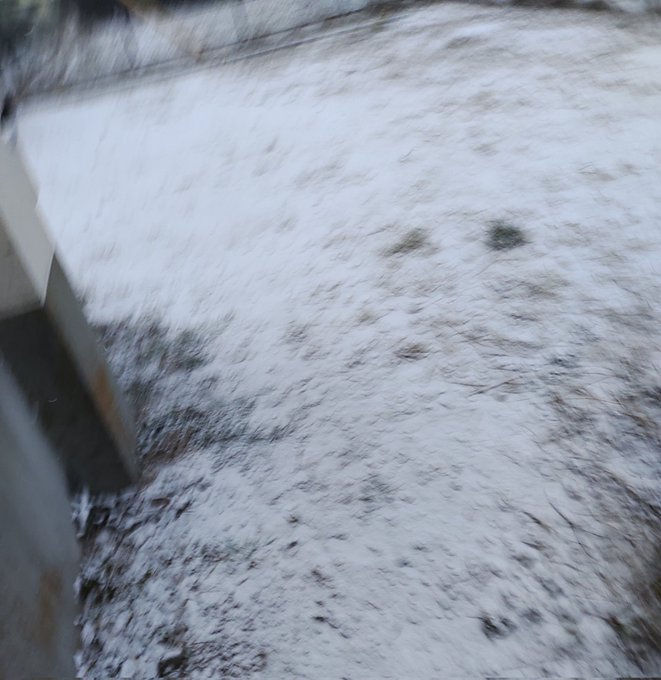

夜が明ける頃。

<!-- more -->

音のない冷たい道を歩く。

朝焼けがわずかに体温を与えてくれる。

目の前の世界が歪んでゆく。

耳鳴りが小さくて懐かしい音楽になっていく。

朝焼けがモノクロになる。

私の手をきゅっと握ってくれる小さな子供。

心の奥底に、ほんの少しの優しさがあるのを感じる。

優しさを抱きしめる。

唯一幸せを感じられる時。

明日までさようなら。

陽の光なんてどこにもなかった。

手先、足先から、冷たくなっていった。

心臓が、冷たい血液を運び始めた。

もうおしまいなんだ。